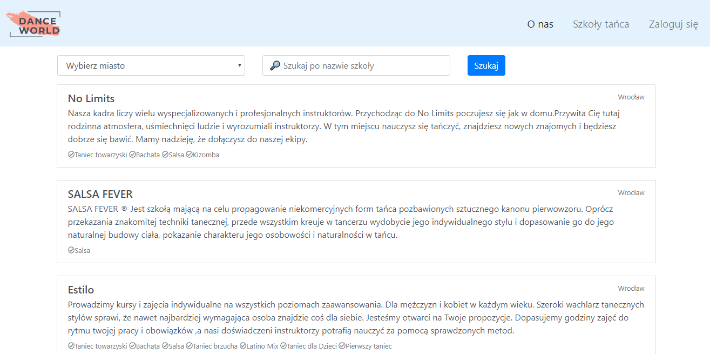
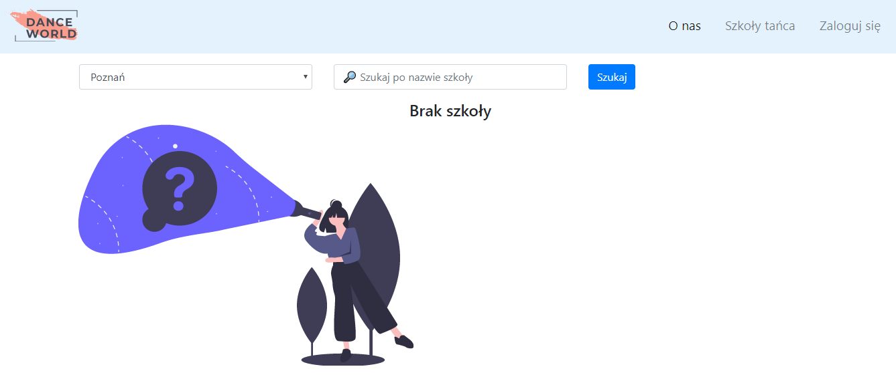
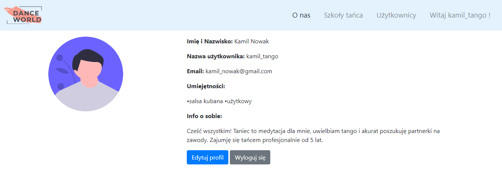
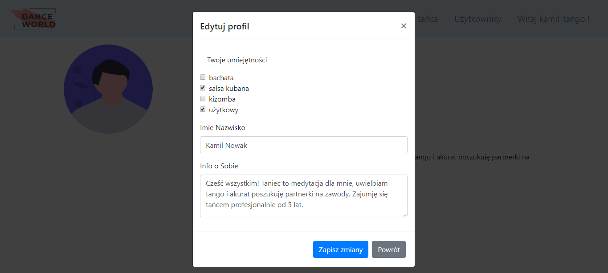
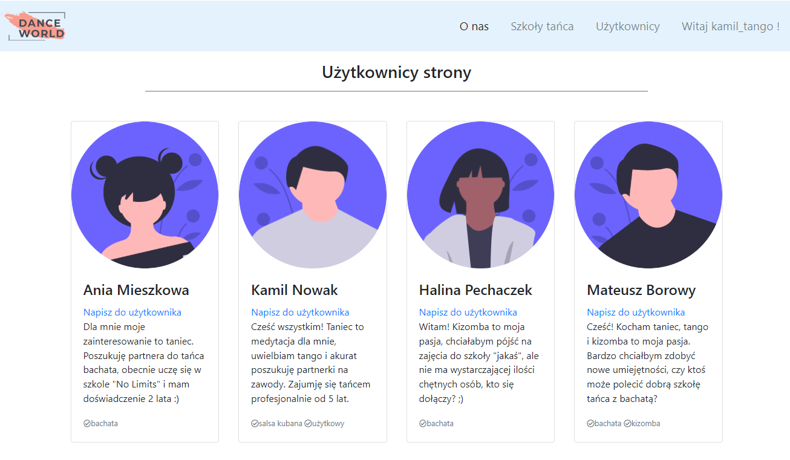

# Dance world 
Aplikacja webowa przedstawiająca szkoły tańca z różnych miast Polski. Za pomocą aplikacji będzie możliwe wyszukanie szkół tańca z listy albo na podstawie kryteriów wybranych przez użytkownika. Aplikacja umożliwia logowanie i rejestrację nowych użytkowników.

## Frameworki:
* Symfony4
* Bootstrap4

## Ilustracje:
https://undraw.co/illustrations 
Strona główna : https://www.freepik.com/free-vector/man-dancing-listening-music_8051289.htm

## Link do aplikacji :
https://gentle-everglades-53070.herokuapp.com/

## Instrukcja do uruchomienia lokalnie: 
* Aby uruchomić aplikację lokalnie trzeba pobrać xampp, następnie dodać folder (nazwa „dance_world”) z całą aplikacją do folderu htdocs po otwarciu folderu xampp
* Uruchomić Apache i MySQL
* W przeglądarce wpisać „http://localhost/dance_world/public/”
* W celu przeglądania lokalnie danych na stronie co są pobierane z bazy danych trzeba w .env wpisać:
DATABASE_URL=mysql://root:@127.0.0.1:3306/dance_world?serverVersion=5.7 
utworzyć w PhpMyAdmin bazę „dance_world” i wypełnić ją przykładowymi danymi. 

## zajęcia 4 :
Stworzono stronę startową oraz połączono projekt z BD. Głównie praca była przeprowadzona ze stylem strony. Templatka „onas.html.twig” zawiera wszystkie elementy strony „O nas”, rozszerza ona templatkę „base. html.twig” którą zawiera „navbar. html.twig”. Arkusz styli znajduje się w folderze public. Stworzono również kontroller  „MainPageController” dla templatek bazowych. (na razie na stronie głównej w sliderze jest tylko pierwsze zdjęcie dobrane do strony, reszta będzie zmieniona żeby pasowała kolorystycznie)

## zajęcia 5: 
Stworzono stronę logowania. Problem się pojawił z encodowaniem hasła, dlatego w celu poprawnego działania zostawię to na następne zajęcie. Również są sprawdzane niektóre warunki przy logowaniu. Templatka „login.html.twig” i „register.html.twig” odpowiednio. Do nich SecurityController. Do walidacji danych w folderze security klasa UzytkownikAuthenticator.

Dodano nowe opcje w menu widoczne po zalogowaniu : wylogowanie użytkownika i widok strony rejestracji.

## zajęcia 6:
Skończono rejestrację użytkownika, dodano nowe pola i ograniczenia. Zmiany możemy zobaczyć w "register.html.twig" i w SecurityController funkcja register. 

Zrobiono również panel użytkownika: zdjęcie, dane, umijętności które użytkownik może zmieniać i wybierać za pomocą popup. Templatka profil.html.twig oraz w MainPageController funkcja infoProfil.

## zajęcia 7: 
Widok listy szkół, który zawiera nazwę szkoły, miasto, opis. Lista jest posortowana alfabetycznie wg nazwy szkoły. Templatka do tego widoku "listaSkol.html.twig", controller "ListaSzkolController". 

Do zrealizowania należało dodać encję Szkoła i Miasto. Są powiązane relacją OneToMany. 

 
## zajęcia 8: 
Wdrożenie aplikacji na Heroku. W projekcie baza danych MySQL przy użyciu dodatku JawsDB. Client - HeidiSQL. Link do aplikacji "https://gentle-everglades-53070.herokuapp.com/" 

## zajęcia 9: 
Utworzono widok szkoły tańca po wyborze z listy szkół. Widok szkół jest w templatce "szkolaInfo.html.twig" i kontroller do tego "SzkolaInfoController.php". Widok się składa z wideo o szkole z YT, pełnego opisu, w footerze jest lokalizacja z goole maps i dane do kontaktu wraz ze stroną internetową. Postanowiłam dodać również do widoku szkoły jej instruktorów. Na razie są to sztywnie wybrane obrazki z opisem. 

Dodane zostały również kategorie tańca którymi się zajmuje szkoła po stworzeniu relacji ManyToMany z encją Umiejętności. 

## zajęcia 10: 
Przy otworzeniu listy szkół pojawia się opcja do wyboru interesującego miasta ze szkołą. Można również wyszukać po nazwie szkoły :

Kiedy nie ma szkoły spełniającej wybrane kryteria:

## zajęcia 11:
Opcja wylogowania znajduje się teraz w profilu użytkownika. 

Teraz użytkownik ma możliwość edycji profilu:

Również po zalogowaniu użytkownik ma możliwość przeglądania profili użytkowników strony. Cel tej strony widoczny w opisie każdego użytkownika:

